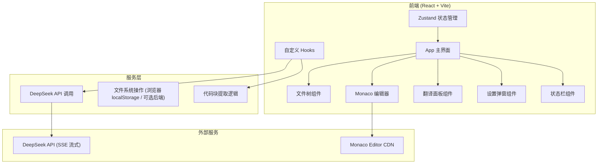

# Decipher — 技术架构文档

## 1. 架构设计



## 2. 技术选型说明

| 层 | 技术选择 | 原因 |
|----|----------|------|
| 前端框架 | **React 18 + TypeScript** | 组件化开发，类型安全，Monaco 生态最成熟 |
| 构建工具 | **Vite** | 极速开发体验，HMR 快 |
| 样式方案 | **Tailwind CSS 3** | 原子化 CSS，快速构建 UI，主题切换方便 |
| 状态管理 | **Zustand** | 轻量，API 简洁，IDE 类应用足够用 |
| 代码编辑器 | **Monaco Editor** (@monaco-editor/react) | VS Code 同款引擎，语法高亮、多语言支持完善 |
| AI 接入 | **fetch + ReadableStream** | 直接调用 DeepSeek SSE 流式接口，逐字渲染 |
| Markdown 渲染 | **react-markdown** | 翻译结果 Markdown 渲染，支持代码高亮 |
| 图标 | **lucide-react** | 现代风格图标库，轻量 |
| 代码高亮 | **react-syntax-highlighter** | 翻译面板中代码块高亮 |

**为什么是纯前端**：MVP 阶段追求最快出活，文件用 localStorage / IndexedDB 存储，后续可加 Electron 壳或 Node.js 后端。

## 3. 项目结构

```
Decipher/
├── src/
│   ├── components/          # UI 组件
│   │   ├── Header.tsx     # 顶部标题栏
│   │   ├── FileTree.tsx   # 左侧文件树
│   │   ├── Editor.tsx     # Monaco 编辑器
│   │   ├── TranslatePanel.tsx  # 右侧翻译面板
│   │   ├── StatusBar.tsx    # 底部状态栏
│   │   └── SettingsModal.tsx   # 设置弹窗
│   ├── hooks/             # 自定义 Hooks
│   │   ├── useDeepSeek.ts   # DeepSeek API 调用
│   │   ├── useWorkspace.ts  # 工作区管理
│   │   └── useDebounce.ts    # debounce 封装
│   ├── store/             # 状态管理
│   │   └── useStore.ts     # Zustand store
│   ├── utils/               # 工具函数
│   │   ├── codeExtractor.ts  # 代码块提取逻辑
│   │   └── languages.ts     # 语言配置
│   ├── types/              # 类型定义
│   │   └── index.ts
│   ├── App.tsx            # 主应用组件
│   ├── main.tsx           # 入口文件
│   └── index.css           # 全局样式 + Tailwind
├── public/
├── index.html
├── package.json
├── vite.config.ts
├── tailwind.config.js
├── tsconfig.json
└── postcss.config.js
```

## 4. 状态管理 (Zustand)

```typescript
interface AppState {
  // 工作区
  workspacePath: string | null;
  files: FileNode[];
  activeFile: string | null;
  fileContents: Record<string, string>;
  
  // 编辑器
  editorContent: string;
  cursorPosition: { line: number; column: number };
  selectedCode: string | null;
  
  // 翻译
  translation: string;
  isTranslating: boolean;
  translationMode: 'auto' | 'deep';
  
  // 设置
  settings: {
    apiKey: string;
    model: string;
    apiBase: string;
    debounceMs: number;
    autoTranslate: boolean;
    theme: 'dark' | 'light';
  };
  
  // UI 状态
  sidebarOpen: boolean;
  translatePanelOpen: boolean;
  settingsOpen: boolean;
}
```

## 5. 核心模块说明

### 5.1 DeepSeek API 调用 (useDeepSeek hook)

- 输入：代码内容 + 语言 + 模式（普通/深译）
- 输出：流式 SSE，逐字回调
- 系统提示词：设定 AI 扮演编程导师，分三段解释代码
- 错误处理：超时、网络错误、API Key 无效

### 5.2 代码块提取 (codeExtractor.ts)

MVP 版本（简版）：
- 根据光标位置，向上查找函数/类定义行（基于缩进和括号匹配
- 支持 Python：根据缩进级别确定代码块范围
- 支持 JS/TS/C++/Java：根据花括号 `{}` 匹配
- 返回：代码块内容 + 起止行号

### 5.3 翻译面板 (TranslatePanel.tsx)

- 三段式布局：
  1. **做了什么** — 一句话总结
  2. **知识点** — 列表形式
  3. **为什么这样写** — 设计意图
- Markdown 渲染 + 代码高亮
- 流式打字机效果
- 加载状态动画

## 6. 数据流

```
编辑器 onChange
    |
    v
debounce (300ms)
    |
    v
提取光标代码块
    |
    v
useDeepSeek hook
    |
    v
DeepSeek SSE API
    |
    v
Zustand store 更新
    |
    v
翻译面板重渲染 (流式)
```

## 7. 关键技术点

1. **Monaco Editor 集成**：使用 @monaco-editor/react，配置深色主题，多语言支持
2. **SSE 流式解析**：手动解析 text/event-stream 格式，增量更新翻译文本
3. **debounce 控制**：lodash.debounce 或自定义 hook，300ms 默认
4. **Markdown 流式渲染**：边接收边渲染，不等待完整响应
5. **localStorage 持久化**：设置、文件内容本地存储
6. **动画效果**：CSS transitions + keyframes，React 动画用 framer-motion（可选）
