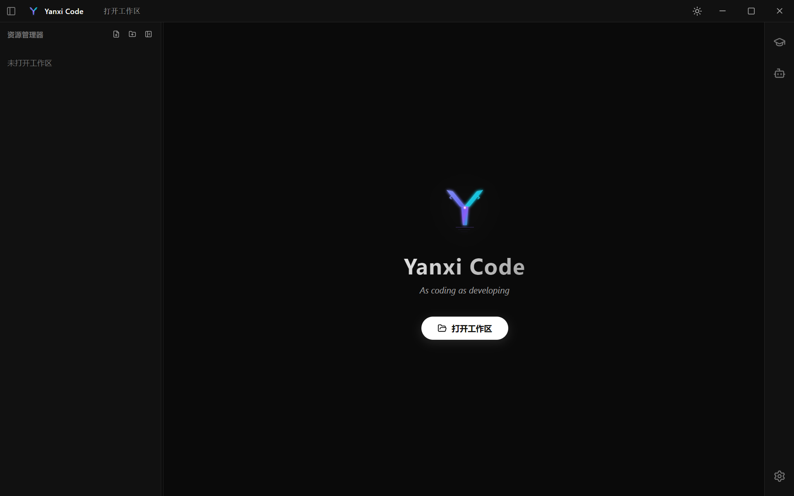
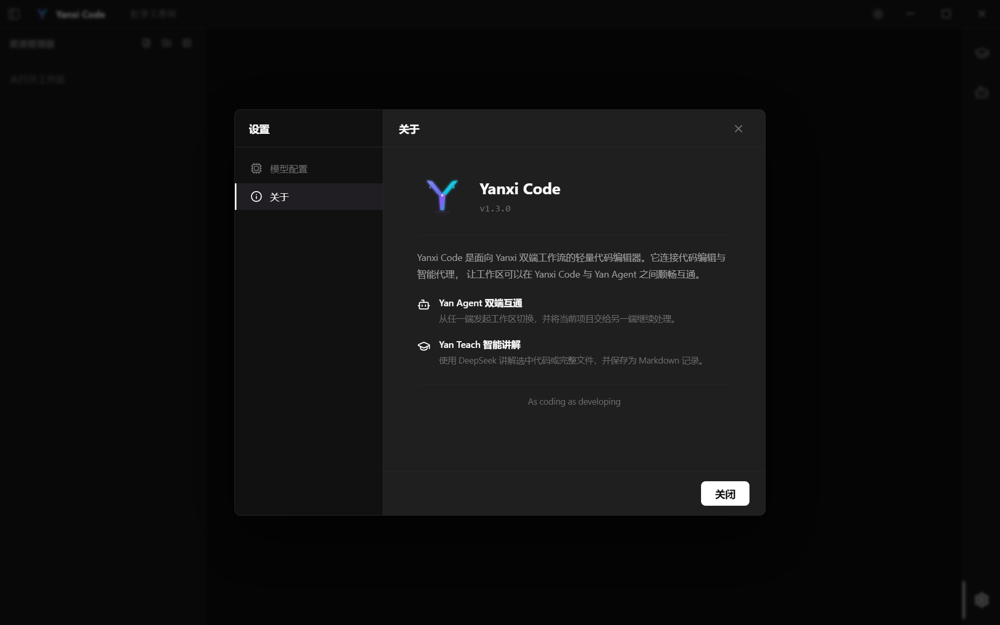

<div align="center">
  
  <h1>Yanxi Code</h1>
  <p>连接代码编辑与智能代理的轻量桌面编辑器</p>
  <p><strong>v1.3.0</strong></p>
  <p><a href="README.en.md">English</a> · <a href="docs/index.html">官网</a></p>
</div>

Yanxi Code 是为 Yanxi 双端工作流打造的桌面代码编辑器。它以 Monaco Editor 提供完整的工作区编辑体验，并与 Yan Agent 双向同步当前工作区；内置的 Yan Teach 还可通过 DeepSeek 将选中代码或完整文件生成为中文 Markdown 讲解。

## 下载

安装版和便携版将在仓库创建后通过 GitHub Releases 发布。两个下载入口已经预留在[官网的下载区](docs/index.html#download)，补入 Release 链接后会直接跳转到对应版本。

> [!IMPORTANT]
> 请在**管理员账户**下安装 Yanxi Code，否则 Yan Agent 到 Yanxi Code 的工作区同步可能发生错误。

| 版本 | 适用场景 | 发布方式 |
| --- | --- | --- |
| Windows 安装版 | 长期使用，自动创建安装目录和快捷方式 | GitHub Release |
| Windows 便携版 | 无需安装，下载后直接运行 | GitHub Release |

## 界面预览

### 工作区入口

启动后可从欢迎页或标题栏打开本地工作区。右侧活动栏提供 Yan Teach、Yan Agent 和设置入口。

<p align="center">
  
</p>

### 关于与双端互通

“关于”页面展示当前版本以及 Yan Agent 双端互通、Yan Teach 智能讲解两项核心能力。

<p align="center">
  
</p>

## 主要功能

- **Yan Agent 双端互通**：从 Yanxi Code 打开 Yan Agent 并传递当前工作区，也可接收 Yan Agent 发起的工作区切换。
- **Monaco 编辑体验**：支持多标签、语法高亮、智能补全、括号配对、文件树、Markdown 预览和未保存状态保护。
- **Yan Teach 智能讲解**：对选中代码或完整文件进行流式讲解，并将结果保存到工作区的 `.yan-teach/*.md`。
- **实时工作区同步**：监听外部文件的创建、修改和删除，及时刷新文件树与编辑器内容。
- **桌面端体验**：提供深浅主题、系统托盘、快捷键以及 Windows 安装版和便携版构建。

## 双端工作流

| 方向                     | 行为                       | 保护机制                               |
| ---------------------- | ------------------------ | ---------------------------------- |
| Yanxi Code → Yan Agent | 启动或唤起 Yan Agent，并传递当前工作区 | 只传递本地路径和请求状态，不复制项目文件               |
| Yan Agent → Yanxi Code | 请求 Yanxi Code 打开或切换工作区   | 路径会先经过校验；存在未保存修改时阻止自动切换            |
| Yan Teach → 工作区        | 讲解选中代码或完整文件              | 结果保存到 `.yan-teach/*.md`，可在编辑器中再次打开 |

## 快速开始

当前版本主要面向 Windows 10/11 x64。开发环境建议使用 Node.js 22 或更新版本。

```powershell
# 在已克隆的 Yanxi Code 仓库中执行
npm ci
npm run dev
```

首次启动后，点击“打开工作区”选择项目目录。常用快捷键：

| 操作     | 快捷键            |
| ------ | -------------- |
| 打开工作区  | `Ctrl+O`       |
| 保存当前文件 | `Ctrl+S`       |
| 新建文件   | `Ctrl+N`       |
| 新建文件夹  | `Ctrl+Shift+N` |
| 关闭当前标签 | `Ctrl+W`       |

## 连接 Yan Agent

1. 安装 [Yan Agent](https://github.com/666-gy/Yan-Agent/releases)，并确保 `Yan Agent.exe` 已加入系统 `PATH`。
2. 在 Yanxi Code 中打开一个工作区。
3. 点击右侧活动栏的 Yan Agent 图标，应用会启动 Yan Agent 并同步当前工作区。

Yan Agent 也可以反向通知 Yanxi Code 打开工作区。若当前编辑器存在未保存内容，Yanxi Code 会阻止自动切换并给出提示。

## 配置 Yan Teach

1. 打开右侧活动栏底部的“设置”。
2. 在“模型配置”中填写 DeepSeek API Key，并选择模型。
3. 打开 Yan Teach 面板讲解完整文件，或在编辑器中选中代码后通过右键菜单发起讲解。

API Key 保存在本机应用存储中。只有在主动使用 Yan Teach 时，所选代码或文件内容才会直接发送到配置的 DeepSeek 官方接口。

## 本地数据与隐私

- 工作区文件始终保留在原目录，Yanxi Code 不会上传整个项目。
- Yan Agent 的工作区交接通过本机文件和启动参数完成。
- DeepSeek API Key 仅保存在本机应用存储中。
- 只有主动发起 Yan Teach 请求时，对应代码内容才会发送到 `https://api.deepseek.com`。

## 开发命令

| 命令                      | 用途                 |
| ----------------------- | ------------------ |
| `npm run dev`           | 启动 Electron 开发环境   |
| `npm test`              | 运行 Vitest 测试       |
| `npm run build`         | 构建主进程、预加载脚本和渲染端    |
| `npm run dist`          | 生成 Windows 安装版与便携版 |
| `npm run dist:portable` | 仅生成 Windows 便携版    |

## 技术栈

Electron、React、TypeScript、Vite、Monaco Editor、Zustand、Vitest。

更多产品介绍与使用说明见[Yanxi Code 官网](docs/index.html)。
